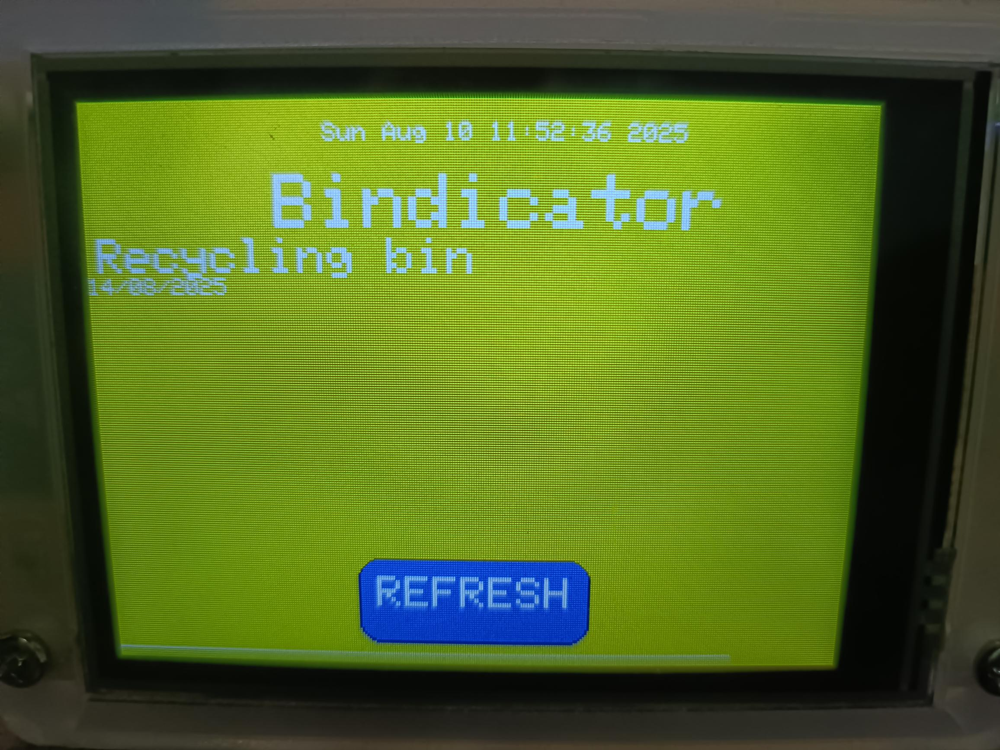

# Bindicator-CYD
Bindicator - reads a google script to access your calendar and colour codes the output to indicate what bin to put out

Inspired by various Bin-indicators (hence, Bindicator), this was a fun little project that connects your CYD (Cheap Yellow Display) to a Google calendar.

This means it will display live data (refreshing every minute, with a neat little progress bar at the bottom - or via the refresh button on the touch screen).

Includes a custom list of keywords and colours - so if it finds the word 'Green' in the title, the background turns green. My recycling bin is yellow, so I have set it to turn yellow when it is recycyling day. Add your own!

Load the .ino in the Arduino IDE. Setup your wifi settings. Create a new calendar within Google Calendars, and call it Bindicator. The google script (code.gs) is required to access the calendar. So you need to create a project in https://script.google.com/ using that script, then deploy it to the web (executing it as your google user), then paste the Web app URL into the arduino script variable.

This project makes use of:
* XPT2046 Touchscreen library - https://github.com/PaulStoffregen/XPT2046_Touchscreen
* TFT_eSPI library for the 320x240px screen - https://github.com/Bodmer/TFT_eSPI
* TFT_eSPI_Button buttons
* WiFiMulti and NetworkClientSecure libraries

